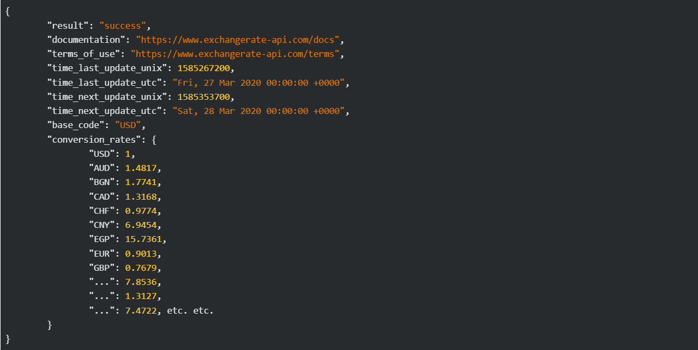
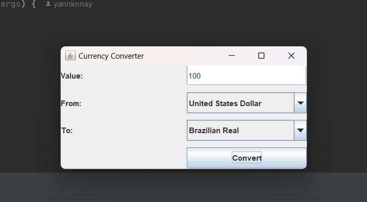
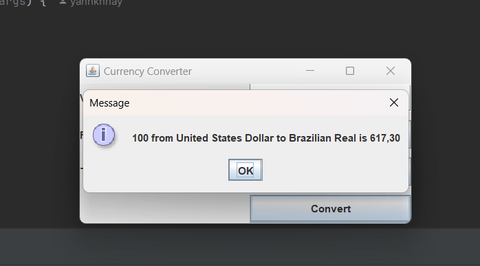

# Challenge Back-end - ONE: Conversor de Moedas

    

## Objetivos:
> Desenvolver um Conversor de Moedas que ofereça interação textual (via console) com os usuários, proporcionando no mínimo 6 opções distintas de conversões de moedas em um menu. A taxa de conversão não será estática, mas sim dinamicamente obtida por meio de uma API, garantindo dados precisos e em tempo real para uma experiência mais atualizada e eficaz.

## API para conversão:
Para a conversão entre moedas foi utilizada a Exchange Rate API. Dessa forma, um dos desafios foi tratar os dados no formato JSON provenientes da API e manipulá-los no código.

    

> Exemplo de resposta da API

## Interface do usuário: Java Swing
A interação do usuário foi feita por meio da interface gráfica nativa do Java, o _Java Swing_, em vez de via console, como o desafio pedia originalmente.

    
    

> Testes do programa

## Conclusão
Este projeto não apenas implementa um conversor de moedas funcional, mas também aplica uma estrutura de design MVC (Model-View-Controller), o que ajuda a organizar o código de forma mais escalável e modular. A interface gráfica foi construída utilizando Java Swing, o que representou um grande desafio, pois exigiu a adaptação de um programa inicialmente pensado para interação via console para uma aplicação visual.

aprendi bastante sobre a manipulação de APIs externas, como o processo de requisição e tratamento de dados em formato JSON, além da integração desses dados com a interface do usuário. A experiência de trabalhar com APIs dinâmicas para conversão de moedas foi fundamental para entender como consumir dados em tempo real de fontes externas e aplicar essas informações no programa.